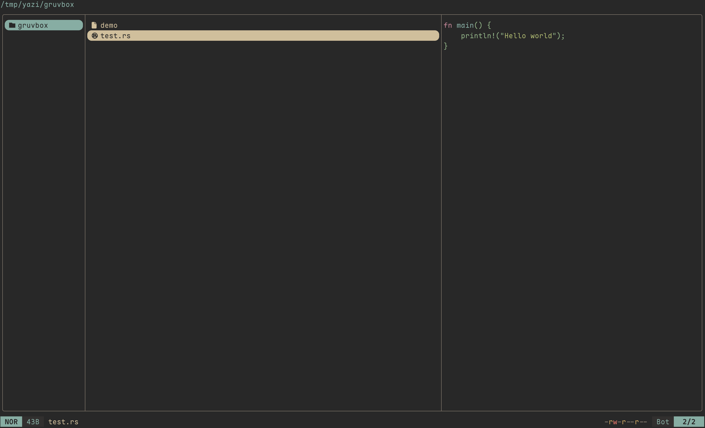

<div align="center">
  
</div>

<h3 align="center">
 Gruvbox Material Flavor for <a href="https://github.com/sxyazi/yazi">Yazi</a>
</h3>

## 👀 Preview



## 🎨 Installation

### Using package manager

```bash
ya pkg add matt-dong-123/gruvbox-material
```

### Manual install

```bash
# Linux/macOS
git clone https://github.com/your-username/gruvbox-material.yazi.git ~/.config/yazi/flavors/gruvbox-material.yazi

# Windows
git clone https://github.com/your-username/gruvbox-material.yazi.git %AppData%\yazi\config\flavors\gruvbox-material.yazi
```

## ⚙️ Usage

Add the these lines to your `theme.toml` configuration file to use it:

```toml
[flavor]
dark = "gruvbox-material"
```

## 📜 License

Check the [LICENSE](LICENSE) file for more details.
